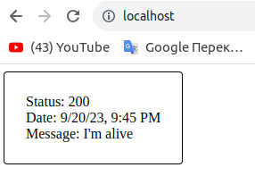

<h3>DO_1</h3>
1.Build docker<br>
```
docker build  --progress=plain  -t devops_intern_leernd007_image .
```

1. Run docker. <br>Put your private key into **~/.ssh/id_rsa**<br>
```
docker run -v $PWD/backup:/root/backup --env SSH_PRV_KEY="$(cat ~/.ssh/id_rsa)" --env MAX_BACKUPS="3" --env BACKUP_RUNS="10" devops_intern_leernd007_image
``` 

<h3>DO_2</h3>
1.In console run command:<br>
```
docker-compose  up --build
```

2. In a browser open:<br>
```
http://localhost
```
3. Congratulations.<br>
   