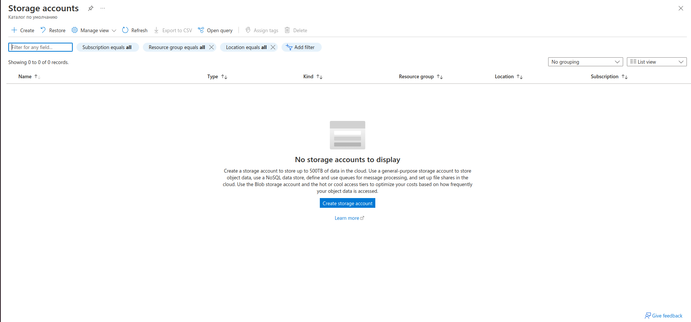

<details>
<summary>DO_1 - Bash Scripting</summary>

1. Build docker

```
docker build  --progress=plain  -t devops_intern_leernd007_image .
```

2. Run docker. <br>Put your private key into **~/.ssh/id_rsa**
  
```
docker run -v $PWD/backup:/root/backup --env SSH_PRV_KEY="$(cat ~/.ssh/id_rsa)" --env MAX_BACKUPS="3" --env BACKUP_RUNS="10" devops_intern_leernd007_image
```
</details>

<details>
<summary>DO_2 - Docker/Docker Compose</summary>

1. In console run command:

```
docker-compose  up --build
```

2. In a browser open:

```
http://localhost
```
3. Congratulations.<br>
   
</details>

<details>
<summary>DO_3 - GitHub Actions</summary>

1. Run workflow manually<br>
   1.1 Run **Backup. Create and push to artifacts**
   ```
   gh workflow run "Backup. Create and push to artifacts" --ref <branch_name>
   ```
   1.2 Run **Backend. Test, build and push to artifacts**
   ```
   gh workflow run "Backend. Test, build and push to artifacts" --ref <branch_name>
   ```
   1.3 Run **Nginx. Build and push to artifacts**
   ```
   gh workflow run "Nginx. Build and push to artifacts" --ref <branch_name>
   ```
   1.3 Run **Frontend. Test, build and push to artifacts**
   ```
   gh workflow run "Frontend. Test, build and push to artifacts" --ref <branch_name>
   ```
</details>

<details>

<summary>DO_4_1 - Azure Portal</summary><br>
    <table>
        <tr>
            <td>
                <details>
<summary>Azure Container Registry (ACR) configuration</summary>


- Click **Create container registry** button <br><br>
  
- **Basics**. Azure Container Registry allows you to build, store, and manage container images and artifacts in a private registry for all types of container deployments. <br><br>
  
- **Networking**. You can connect to this registry either publicly, via public IP addresses, or privately, using a private endpoint. <br><br>
  
- **Encryption**. Azure Container Registry service encryption protects your data at rest. Azure Container Registry encrypts your images and other artifacts when they're pushed to your registry and automatically decrypts when you pull them. <br><br>
  
- **Tags**. Tags are name/value pairs that enable you to categorize resources and view consolidated billing by applying the same tag to multiple resources and resource groups. <br><br>
  
- **Review + Create**. <br><br>
  
- Click **Create** button and after a few seconds, the ACR will be ready to use. <br><br>
  
  </details>
  </td>
  </tr>
    </table>
    <table>
        <tr>
            <td>
                <details>
<summary>Storage Account (SA) configuration</summary>


- Click **Create storage account** button <br><br>
  
- **Basics**. Azure Storage is a Microsoft-managed service providing cloud storage that is highly available, secure, durable, scalable, and redundant. <br><br>
  
- **Advanced**. Configure advanced options for your storage. <br><br>
  
- **Networking**. Configure networking options for your storage. <br><br>
  
- **Data protection**. Protect your data from accidental or erroneous deletion or modification. <br><br>
  
- **Encryption**. Your data is encrypted by default using Microsoft-managed keys. For additional control over your data, encrypt using customer-managed keys via the Azure Key Vault. <br><br>
  
- **Tags**. Tags are name/value pairs that enable you to categorize resources and view consolidated billing by applying the same tag to multiple resources and resource groups. <br><br>
  
- **Review**. <br><br>
  
- Click **Create** button and after a couple of seconds Storage Account will be ready for using. <br><br>
  
  </details>
  </td>
  </tr>
    </table>
    <table>
        <tr>
            <td>
                <details>
<summary>Virtual Machine (VM) configuration</summary>


- An Azure **virtual machine** gives you the flexibility of virtualization without having to buy and maintain the physical hardware that runs it. <br><br>
  
- **Basics**. Create a virtual machine that runs Linux or Windows. Select an image from Azure marketplace or use your own customized image. <br><br>
  
- **Disks**. Azure VMs have one operating system disk and a temporary disk for short-term storage. You can attach additional data disks. The size of the VM determines the type of storage you can use and the number of data disks allowed. <br><br>
  
- **Networking**. Define network connectivity for your virtual machine by configuring network interface card (NIC) settings. You can control ports, inbound and outbound connectivity with security group rules, or place behind an existing load balancing solution. <br><br>
  
- **Management**. Configure management options for your VM. <br><br>
  
- **Monitoring**. Configure monitoring options for your VM. <br><br>
  
- **Advanced**. Add additional configuration, agents, scripts or applications via virtual machine extensions or cloud-init. <br><br>
  
- **Tags**. Tags are name/value pairs that enable you to categorize resources and view consolidated billing by applying the same tag to multiple resources and resource groups. <br><br>
  
- Review + create. <br><br>
  
- Click **Create** button and after a couple of seconds the virtual machine will be ready for using. <br><br>
  
- Let's configure DNS for our just created vm. Click as on the screen bellow <br><br>
  
- Specify any DNS name as you wish <br><br>
  
  </details>
  </td>
  </tr>
    </table>
</details>

<details>
<summary>DO_5 - Deploy the application</summary>

1. Build docker images

```
docker compose --file docker-compose-prod.yaml  up  -d --build
```

2. APP Ip address

```
20.79.166.75
```

2. APP DNS name

```
my-virtual-machine-dns.germanywestcentral.cloudapp.azure.com
```
</details>